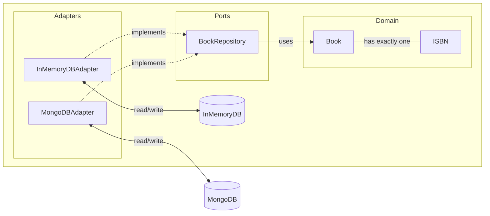
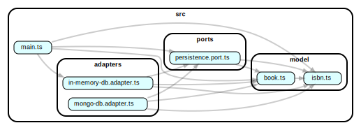

# domain-model
This is a playground for designing safe domain models + port/adapter architecture in typescript.

```mermaid
flowchart LR

subgraph  
subgraph Domain 
    Book-- has exactly one ---ISBN

end
subgraph Ports 
    BookRepository
end
subgraph Adapters 
    InMemoryDBAdapter
    MongoDBAdapter
end
InMemoryDB[(InMemoryDB)]
end

MongoDB[(MongoDB)]

InMemoryDBAdapter-. implements .->BookRepository
MongoDBAdapter-. implements .->BookRepository

BookRepository-- uses -->Book

InMemoryDBAdapter<-- read/write -->InMemoryDB
MongoDBAdapter<-- read/write -->MongoDB
```

## Generated code dependency graph
